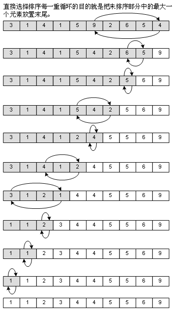
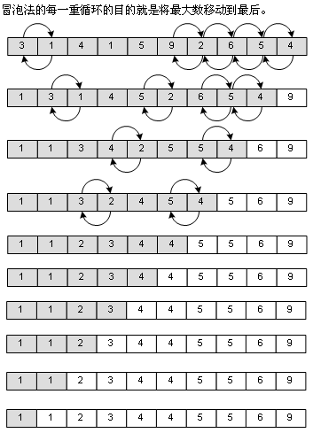
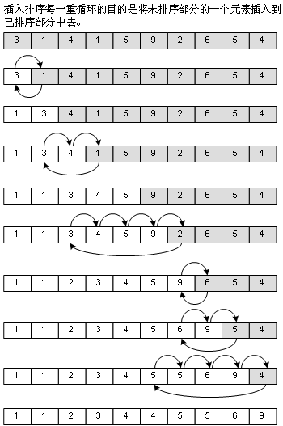
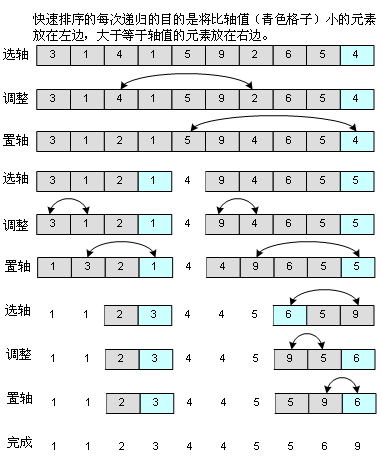
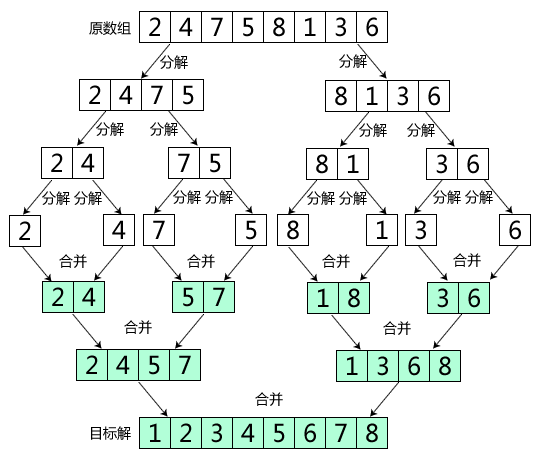

## 排序算法

### 选择排序
每一次从待排序的数据元素中选出最小（或最大）的一个元素，存放在序列的起始位置（末尾位置），直到全部待排序的数据元素排完。

### 冒泡排序
对需要排序的数组从后往前（逆序）进行多遍的扫描，当发现相邻的两个数值的次序与排序要求的规则不一致时，就将这两个数值进行交换。这样比较小（大）的数值就将逐渐从后面向前面移动。

### 直接插入排序
直接插入排序的原理是，从第二个数开始向右侧遍历，每次均把该位置的元素移动至左侧，放在一个正确的位置（比左侧大，比右侧小）。

### 二分插入排序
这是对直接插入排序的改进，由于已排好序的部分是有序的，所以我们就能使用二分查找法确定我们的插入位置，而不是一个个找，除了这点，它跟插入排序没什么区别。

### 快速排序
通过一趟排序将要排序的数据分割成独立的两部分，其中一部分的所有数据都比另外一部分的所有数据都要小，然后再按此方法对这两部分数据分别进行快速排序，整个排序过程可以递归进行，以此达到整个数据变成有序序列。

### 归并排序
归并排序（MERGE-SORT）是利用归并的思想实现的排序方法，该算法采用经典的分治（divide-and-conquer）策略（分治法将问题分(divide)成一些小的问题然后递归求解，而治(conquer)的阶段则将分的阶段得到的各答案"修补"在一起，即分而治之)。

### 希尔排序
希尔排序是希尔（Donald Shell）于1959年提出的一种排序算法。希尔排序也是一种插入排序，它是简单插入排序经过改进之后的一个更高效的版本，也称为缩小增量排序，同时该算法是冲破O(n2）的第一批算法之一。

[希尔排序](https://www.cnblogs.com/skywang12345/p/3597597.html)

### 堆排序
堆排序是利用堆这种数据结构而设计的一种排序算法，堆排序是一种选择排序，它的最坏，最好，平均时间复杂度均为O(nlogn)，它也是不稳定排序。首先简单了解下堆结构。

[堆排序](https://www.cnblogs.com/chengxiao/p/6129630.html)
[堆排序](https://www.cnblogs.com/skywang12345/p/3602162.html)

### 计数排序

### 桶排序

### 基数排序

